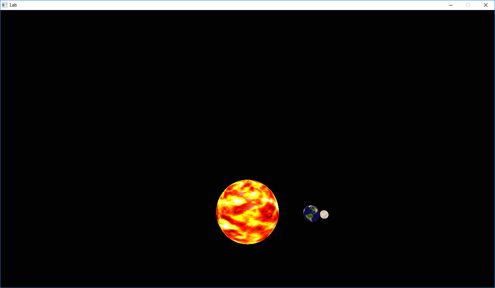

# Assignment 5 - Scenegraph



*TODO*: Please edit the following information in your assignment

* Name and partners name(At most 1 partner for this Assignment): 
* How many hours did it take you to complete this Assignment? 
* Did you collaborate or share ideas with any other students/TAs/Professors? 
* Did you use any external resources? 
  * (tbd if any)
  * (tbd if any)
  * (tbd if any)
* (Optional) What was the most interesting part of the assignment? How would you improve this assignment?
  
## Description

We have learned how to draw models in the previous assignment(s) using the OBJ file format for loading an objects geometry. Additionally, throughout the course we have learned some abstractions to help enable us in creating larger graphical scenes with many objects (e.g. std::vector). However, it can quickly become difficult to manage many different objects in a scene, especially when those scenes are large. In order to create larger graphical scenes, a scenegraph is the dominate data structure used by graphics programmers for organizing data in a scene. For this assignment, we will be focusing on implementing a [scene graph](https://en.wikipedia.org/wiki/Scene_graph) and understanding how transformations of one object are propogated to others.
  
### Assignment Strategy

In order to get started with this assignment, I recommend reading this short .pdf [Read this tutorial](./media/SceneGraph.pdf). The provided tutorial should give you a nice theoretical and applied example of what you are implementing. Note for this assignment, there *should* not be many code changes required.
  
## Scenegraphs

A scenegraph is nothing more than a 'tree' data structure. There is a root of some 'object' at the top, and then every other object that exists is added into a single tree. There may additionally be other 'nodes' in the tree that have meaning in our 3D scene. For example, lighting, a camera, rigid bodies(for physical simulations), or transformations. 

Here is an example of a scenegraph in a graphics scene.


 ### SceneNode.h

In our scenegraph, we only have one type of node (Found in SceneNode.h). SceneNode's contain the following information:

```cpp
 protected:
     // Parent
     SceneNode* parent;
 private:
     // Children holds all a pointer to all of the descendents
     // of a particular SceneNode. A pointer is used because
     // we do not want to hold or make actual copies.
     std::vector<SceneNode*> children;
     // The object stored in the scene graph
     Object* object;
     // Each SceneNode nodes locals transform.
     Transform localTransform;
     // We additionally can store the world transform
     Transform worldTransform;
```

Notice that a SceneNode has a transformation and geometry embedded within them. SceneNode's also know who their parent node is, and all of their children. You may think about how and why we have a local and a world transform stored for our node.
  
Again, the majority of this assignment is understanding how to perform a tree traversal and apply transformations from one object successively to the next. In fact, there are only a few lines of code to implement (Less than 5 lines).

## Part 1 - Usage of Scene graph

## Task 1 - Solar System

For this assignment you are going to create a solar system.

This involves the following:
- Figuring out how to do the scenegraph transformation (stated above).
- Modify SceneNode::Update(...) to make sure transformations are pushed from the parent to the child.
- Next, create a solar system with at least 3 planets, and 6 moons.
	- There is a sample provided in: SDLGraphicsProgram::loop() for how to use our interface.
	- Feel free to be creative. You may even modify the shader to get some interesting effects.

## Task 2 - Why is our scenegraph efficient?

In a few sentences why is our approach of storing a local and world transform more efficient than doing a depth-first traversal to find the final position of an object in world space?
  
**Answer here**: *Your answer here*
  
## How to run your program

Your solution should compile using the `build.py` file. That is, we will run your program by typing 'python build.py' and it should just work.

Your program should then run by typing in: `./lab`  


## Deliverables

- A solar system with at least 3 planets and 6 moons.
- Edit the readme to answer Task 2

* You need to commit your code to this repository.

### Rubric

<table>
  <tbody>
    <tr>
      <th>Points</th>
      <th align="center">Description</th>
    </tr>
    <tr>
      <td>30% (Core)</td>
      <td align="left">Is the code clearly documented? Are there no memory leaks?  Did you make sure your code worked with the 'build.py' or did we have a headache compiling your code?</td>
    </tr>   
    <tr>
      <td>60% (Core)</td>
      <td align="left">(70%)Does the scene properly render</td>
	</tr>
    <tr>
      <td>10% (Advanced)</td>
      <td align="left">(10%)Did you answer why our scene graph strategy is often better than a full depth-first traversal?</td>
	</tr>	
  </tbody>
</table>


## More Resources

Links on Scenegraphs
* (**KEY resource**) [Read this tutorial](./media/SceneGraph.pdf)
* Nice slideshow on scene graphs: https://www.cs.utexas.edu/users/fussell/courses/cs354/lectures/lecture13.pdf
* https://www.panda3d.org/manual/index.php/The_Scene_Graph
* http://www.realityprime.com/blog/2007/06/scenegraphs-past-present-and-future/
* http://what-when-how.com/advanced-methods-in-computer-graphics/scene-graphs-advanced-methods-in-computer-graphics-part-3/
* https://en.wikipedia.org/wiki/Tree_traversal

## Going Further

* Try drawing the orbits for the planets and moons (This will make things just slightly cooler looking)
* Try implementing a custom 'planet shader' for each of the planets.
	* For instance, scrolling the uv coordinates on the Sun may make it have an interesting effect!

## F.A.Q

* Q: Why a scenegraph?
	* A: It is a standard structure for organizing 3D scenes.
* Q: Can I implement a totally new data structure instead of the one provided?
	* A: Sure
