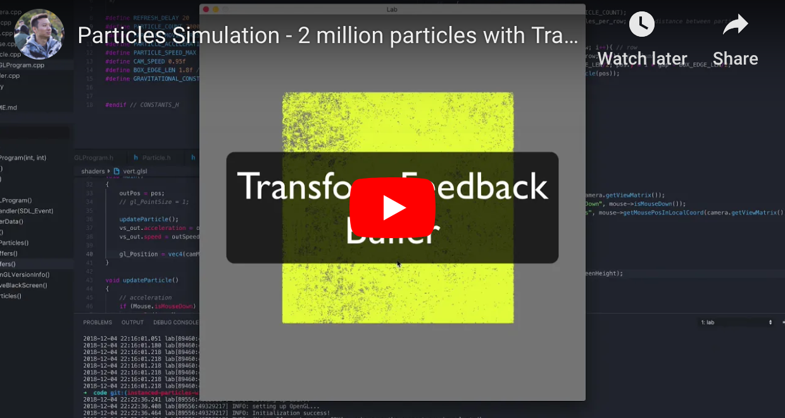

# [OpenGL] Particles Simulation - 2 million particles with TransformFeedback buffers

* Demo Video:   
    [](https://youtu.be/nFGZ6Hcqzc8 "Demo Video")
 
## Brief Introduction
This project is about **Particle Simulation** on the GPU with OpenGL.  
Originally, I store and update particles data on the main memory and buffer that data to GPU for every single frame;  
But with the technique of **Transform Feedback Buffer**, I am able to update the data directly on the GPU in parallel, thus saving PCI bandwidth and CPU efforts.  
The performance improvement is more than **20X**, jumping from rendering 320K particles to 2 million particles. 

## Detailed Description 
This project is about particle simulation with gravitational force.  
Particle movement is caused by gravitational force at where the pointer is clicked, the stronger the force the darker the color of its appearance.  
And following Newtons's law of gravitation, the closer the particle to the pointer the stronger the force, thus faster acceleration. 

If the mouse is released, the particles will slow down, due to a constant resistance force, think of this force as friction. The resistance force's direction is always opposite to the particle's moving direction.  
You can use the scroll wheel to zoom in and out and arrow keys to pan. 

This simple physics principles generates very interesting animation.  
But that is not very exciting, the more exciting part is how we are able to handle 2 millions particles rendering at 60fps. 

We used a technique called **TransformFeedback**. 

Originally, we keep the particles data in the main memory, and we update them and buffer them to GPU at every frame. That's quite slow and computational intensive because the particles are constantly changing. 

**TranformFeedback** allows us to update the data on GPU directly, so we are not copying data between CPU and GPU any more. 

Due to OpenGL's constraints, we can't read and write to the same buffer at the same time. 
So we use two vertex buffers, we read particles data from one, write the updated particles data to another. and we toggle between those two buffers at the next frame. And all of these happens on the GPU without CPU intervention. 

The performance improvement is **more than 20 fold**. 

For the old approach, my computer starts to struggle at 320k particles;  
while with TransformFeedback, all the calculations are happening on the GPU like free of charge, my computer is able to handle 2 million particles rendering at 60fps smoothly. 

According to my experiments, I start to see severe lag at 5 million particles. 

### Animation
Particle movement is caused by gravitational force, the stronger the force the darker the color of its appearance. 

- Click generates a force onto surrounding particles and leaving those particles with an initial speed the same as mouse moving speed;
- Particle color is determined by the moving speed. 
- Acceleration is caused by gravitational force to the mouse. i.e. The closer a particle to the mouse(when clicked down) position, the bigger its acceleration. 
    - If the click holds, each particle's the acceleration vector (in terms of both direction and magnitude) keeps changing towards the the pointer for every frame;  
        (e.g. new_acceleration = current_acceleration + new_gravitational_acceleration)
    - If mouse releases, the particle will slow down, due to a constant resistence force, to stationary. 

### Interactivity 
#### Mouse 
| Control      | Description                                       |
| ------------ | ------------------------------------------------- |
| Scroll Wheel | Zoom In/Out                                       | 
| Click        | Applys gratational force to surrounding particles | 

#### Keyboard 
| Control    | Description |
| ---------- | ----------- |
| Left⇧      | Zoom In     | 
| Left⌃      | Zoom Out    | 
| ←, ↑, →, ↓ | Move Around | 


### Implementation 

### Structs 
#### 1. Particle 
| Particle          |
| ----------------- |
| vec2 acceleration |
| vec2 speed        |
| vec2 pos          |
#### 2. MouseDown
| MouseDown |
| --------- |
| vec2 pos  |

### Globals/Constants
All constants are in constants.h file. 
  
## How to run the project

### Compile
``` sh
$ python build.py
# The project requires SDL2 library. 
```
### Run
``` sh
$ ./lab
```
    
## References
  * https://www.youtube.com/watch?v=RMfsdUKEmDo
  * [transform feedback](https://github.com/g-truc/ogl-samples/blob/master/samples/gl-320-transform-feedback-interleaved.cpp)